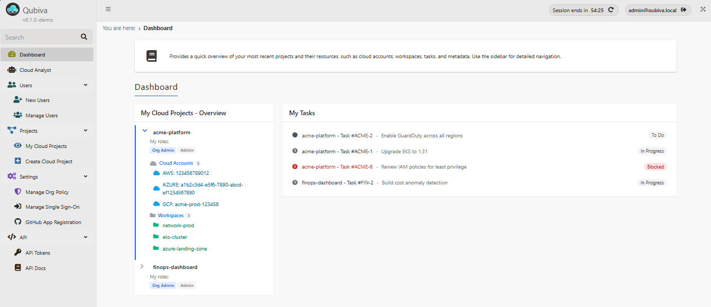

# Qubiva

[](LICENSE)
[](https://github.com/Qubiva/qubiva/actions/workflows/ci.yaml)

Open-source Kubernetes-native platform for OpenTofu/Terraform operations, cloud governance, compliance, resource discovery, AI-assisted infrastructure analysis, and LLM spend governance.

Qubiva helps platform teams stop stitching together separate tools for IaC execution, cloud inventory, policy enforcement, compliance scanning, dashboards, and operational workflows.

Built for AWS, Azure, and GCP with self-hosted deployment, unified RBAC, SSO, audit trails, automation, and bring-your-own LLM support.

---

## Getting Started

**Evaluating Qubiva?** Use the demo — no cloud account or Kubernetes cluster needed. Pre-loaded with sample data so you can explore the full UI immediately.

**Ready to deploy?** Install on Kubernetes using the Helm chart. This is the only path that connects to real cloud accounts and runs actual IaC operations.

---

## Try the Demo

### Demo Option 1 — GitHub Codespaces (no setup at all)

Launch a fully working demo instantly in GitHub Codespaces.

- No cloud account required
- No Kubernetes setup required
- Pre-loaded with sample infrastructure data
- Explore discovery, compliance, IaC runs, AI querying, LLM governance, tasks, and more immediately

[](https://codespaces.new/qubiva/qubiva?quickstart=1)

Click the button above, then **"Create new codespace"**. Wait for setup to complete. A browser tab will open automatically with the app.

If your browser blocks the popup, go to the **Ports** tab in the Codespaces editor and open the URL for port 80.

#### Demo credentials

```text
Email: admin@qubiva.local
Password: Demo@2026
```

> Codespaces is free for up to 60 hours/month. Remember to delete your codespace at https://github.com/codespaces when you're done to conserve your free hours.

### Demo Option 2 — Run locally with Docker

```bash
git clone https://github.com/qubiva/qubiva.git
cd qubiva
docker compose up
```

Then open:

```text
http://localhost
```

Use the same demo credentials above.

> Both demo options run with pre-loaded sample data for evaluation only. Neither connects to real cloud accounts or executes live IaC operations. For a real deployment, use the Helm chart below.

---

## Deploy on Kubernetes (Full Deployment)

Install Qubiva on any Kubernetes cluster using the Helm chart. This is the full deployment — connects to real cloud accounts, executes OpenTofu/Terraform operations, and persists all data.

```bash
helm install qubiva oci://ghcr.io/qubiva/charts/qubiva \
  --namespace qubiva --create-namespace
```

Encryption keys and secrets are auto-generated on first install and preserved across upgrades.

### Provide your own encryption key

```bash
# Generate a Fernet-compatible encryption key
python3 -c 'import base64, os; print(base64.urlsafe_b64encode(os.urandom(32)).decode())'

# Pass it during install
helm install qubiva oci://ghcr.io/qubiva/charts/qubiva \
  --namespace qubiva --create-namespace \
  --set secrets.localEncryptionKey="YOUR_KEY_HERE"
```

### Access the dashboard

```bash
kubectl port-forward -n qubiva svc/qubiva 8000:80
```

Open:

```text
http://localhost:8000
```

Retrieve the generated admin password:

```bash
kubectl get secret qubiva-initial-admin-secret -n qubiva \
  -o jsonpath='{.data.password}' | base64 -d
```

---

## Why Qubiva?

Modern platform teams often end up stitching together:

- Terraform/OpenTofu execution tools
- Cloud inventory and discovery tools
- Compliance scanners
- OPA policy enforcement
- Internal dashboards
- Operational workflows and approvals
- AI tooling bolted onto infrastructure later

Qubiva brings these capabilities together into a single self-hosted Kubernetes-native platform with unified credentials, consistent RBAC, centralized auditability, and no vendor lock-in.

### What Qubiva provides

- Infrastructure as Code execution
- Multi-cloud resource discovery using SQL
- Compliance benchmarks and policy enforcement
- AI-powered infrastructure querying
- LLM spend governance and virtual key access control
- Operational workflows and task management
- Shared credentials and project isolation
- Scheduled automation and alerts
- SSO, RBAC, and audit trails

---

## Screenshots

[](https://qubiva.github.io/qubiva/screenshots/)

**[View all screenshots →](https://qubiva.github.io/qubiva/screenshots/)**

---

## Core Features

### Infrastructure as Code

- Execute OpenTofu/Terraform plans and applies
- State management
- Run history
- Real-time log streaming
- Kubernetes Job-based isolated execution

### Cloud Discovery

- Query live cloud resources using SQL
- Multi-cloud inventory visibility
- Shared cloud credentials across projects
- AWS, Azure, and GCP support

### Compliance & Policy Enforcement

- CIS, SOC 2, HIPAA, PCI DSS, NIST 800-53, and more
- OPA/Conftest policy checks
- Pre-deployment policy enforcement
- Scheduled compliance automation

### Cloud Analyst (Bring Your Own LLM)

Query infrastructure in natural language using any OpenAI-compatible provider.

Supports:

- OpenAI
- Azure OpenAI
- Groq
- Google Gemini
- Other OpenAI-compatible APIs

### AI Governance

Manage and control LLM access across your organisation through an integrated AI Gateway (LiteLLM proxy).

- **Model management** — configure and route across multiple LLM providers from one place
- **Virtual keys** — issue scoped access keys to teams with per-key budget limits and rate limits
- **Spend tracking** — real-time and historical spend by model, by key, and per-request logs
- **Date-range filtering** — drill into spend for any time window with a visual trend chart
- **Spend log retention** — configurable automatic purge of old spend logs (default: 90 days)

Requires the AI Gateway (LiteLLM proxy) to be enabled in your Helm deployment. Fully visible in the demo with pre-generated spend data.

### Operational Workflows

- Tasks, sprints, priorities, assignments
- Comments with @mentions
- Email notifications
- Task relationships (blocks, parent/child, related)

### Enterprise Features

- SAML 2.0 SSO
- Organization and project-level RBAC
- Full audit trails
- Scheduled automation
- Email alerts
- GitHub integration

---

## Supported Clouds

| Capability | AWS | Azure | GCP |
|------------|-----|-------|-----|
| IaC execution (OpenTofu/Terraform) | ✓ | ✓ | ✓ |
| Resource discovery (SQL) | ✓ | ✓ | ✓ |
| Compliance benchmarks | ✓ | ✓ | ✓ |
| AI-powered querying | ✓ | ✓ | ✓ |
| Credential management | ✓ | ✓ | ✓ |

---

## Architecture

```text
┌─────────────────────────────────────────────┐
│                  Qubiva                    │
│ FastAPI + Jinja2 │ MongoDB Replica Set     │
│ Kubernetes-native │ Artifacts on PVC       │
└────────┬──────────┴──────────┬─────────────┘
         │                     │
    ┌────▼────┐          ┌─────▼─────┐
    │ IaC     │          │ Discovery │
    │ Runner  │          │ Runner    │
    │ (K8s    │          │ (K8s      │
    │ Jobs)   │          │ Jobs)     │
    └─────────┘          └───────────┘
```

### Components

- **App Deployment** — Serves UI/API and orchestrates workflows
- **IaC Runner Jobs** — Isolated OpenTofu/Terraform execution
- **Discovery Runner Jobs** — Cloud discovery and compliance execution
- **MongoDB** — Stores users, projects, tasks, credentials, and metadata
- **Loki** — Retains logs beyond Kubernetes pod lifetime

---

## Configuration

Qubiva uses a layered configuration system:

1. Image defaults (`app_config.default.json`)
2. ConfigMap overrides (`/app/config/app_config.json`)
3. Environment variables and secrets

---

## IaC Engine

OpenTofu is the default engine.

Switch to Terraform:

```json
{
  "terraform": {
    "engine": "terraform"
  }
}
```

---

## Cloud Analyst Configuration

Bring your own LLM.

Supports any OpenAI-compatible API.

```json
{
  "cloud_analyst": {
    "enabled": true,
    "llm": {
      "provider": "openai",
      "model": "gpt-4o",
      "base_url": "https://api.openai.com/v1/",
      "api_key_env": "LLM_API_KEY"
    }
  }
}
```

Set `LLM_API_KEY` using an environment variable or Kubernetes secret.

---

## AI Governance Configuration

AI Governance requires the bundled LiteLLM AI Gateway. Enable it in your Helm values:

```yaml
aiGateway:
  enabled: true
  postgresql:
    enabled: true
```

The gateway URL and master key are wired automatically when `aiGateway.enabled: true`.

Configure spend log retention (default: 90 days):

```json
{
  "ai_governance": {
    "spend_logs_retention_days": 90
  }
}
```

---

## Helm Chart Values

| Value | Default | Description |
|-------|---------|-------------|
| `image.repository` | `ghcr.io/qubiva/qubiva` | App container image |
| `image.tag` | Chart appVersion | Image tag |
| `ingress.enabled` | `false` | Enable Ingress |
| `ingress.host` | `qubiva.local` | Ingress hostname |
| `iacEngine` | `tofu` | IaC engine (`tofu` or `terraform`) |
| `mongodb.enabled` | `true` | Deploy bundled MongoDB |
| `secrets.*` | (required) | Database URL, encryption keys, API keys |

See `helm/qubiva/values.yaml` for the complete list.

---

## Development Setup

### Local Helm development (Docker Desktop Kubernetes)

**Namespace:** `qubiva` | **Image:** `qubiva:dev` | **Release:** `qubiva`

Build and deploy:

```bash
docker build -t qubiva:dev .
helm upgrade qubiva ./helm/qubiva -n qubiva --reuse-values
kubectl rollout restart deployment/qubiva -n qubiva
kubectl rollout status deployment/qubiva -n qubiva
```

Port-forward (run this every session before opening the app):

```bash
kubectl port-forward svc/qubiva -n qubiva 8080:80
```

App is at **http://localhost:8080**

**Admin credentials — `admin@qubiva.local`**

On first install the password is stored in a K8s secret:

```bash
kubectl get secret qubiva-initial-admin-secret -n qubiva \
  -o jsonpath="{.data.password}" | python -c "import sys,base64; print(base64.b64decode(sys.stdin.read()).decode())"
```

If that secret is missing (admin existed from a prior install), reset via MongoDB:

```bash
kubectl exec -n qubiva deployment/qubiva -- python -c "
import asyncio, os, bcrypt
async def main():
    from motor.motor_asyncio import AsyncIOMotorClient
    client = AsyncIOMotorClient(os.environ['DATABASE_URL'])
    db = client['qubiva']
    hashed = bcrypt.hashpw(b'NewPassword123!', bcrypt.gensalt(rounds=12)).decode()
    await db.users.update_one({'username': 'admin@qubiva.local'}, {'\$set': {'hashed_password': hashed}})
    print('Password reset.')
asyncio.run(main())
"
```

---

### Prerequisites

- Python 3.11+
- MongoDB 7+ with replica set enabled

### Setup

```bash
python -m venv venv
source venv/bin/activate
pip install -r requirements.txt
python main.py
```

Windows:

```bash
venv\Scripts\activate
```

Required environment variables:

- `DATABASE_URL`
- `LOCAL_ENCRYPTION_KEY`
- `LOCAL_SIGNING_KEY`
- `JWT_SECRET`

---

## Project Structure

```text
app/
  app.py               # FastAPI entry point
  deps.py              # Shared dependencies and managers
  routes/              # Route modules
  llm/                 # LLM provider abstraction
  chat_manager.py      # Cloud Analyst orchestration
  runner_pool.py       # Pre-warmed K8s runner pools

helm/qubiva/           # Helm chart
iac_runner/            # IaC runner image
discovery_runner/      # Discovery/compliance runner image
pages/jinja2templates/ # UI templates
static/                # CSS, JS, images
```

---

## Contributing

See [CONTRIBUTING.md](CONTRIBUTING.md) for development setup and pull request guidelines.

---

## Security

To report a vulnerability, see [SECURITY.md](SECURITY.md).

---

## License

[GNU Affero General Public License v3.0](LICENSE)

See [THIRD-PARTY-LICENSES.md](THIRD-PARTY-LICENSES.md) for dependency attributions.
